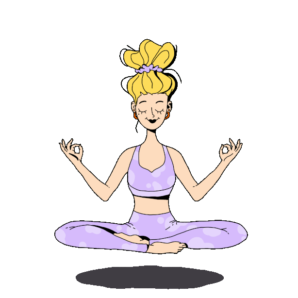

  <pre align="center">
    <strong>Maria Pavlou </strong>
    <a href="https://maria-paul.github.io/">Homepage</a> | <a href="https://www.instagram.com/radioactivebunnies/">Instagram</a> | <a href="https://github.com/maria-paul">GitHub</a></pre>
 

### Hi there 👋

  

I'm Maria and I am a creative individual experimenting many many different things! 😄

<!--
**maria-paul/maria-paul** is a ✨ _special_ ✨ repository because its `README.md` (this file) appears on your GitHub profile.

Here are some ideas to get you started:

- 🔭 I’m currently working on ...
- 🌱 I’m currently learning ...
- 👯 I’m looking to collaborate on ...
- 🤔 I’m looking for help with ...
- 💬 Ask me about ...
- 📫 How to reach me: ...
- 😄 Pronouns: ...
- ⚡ Fun fact: ...
-->
